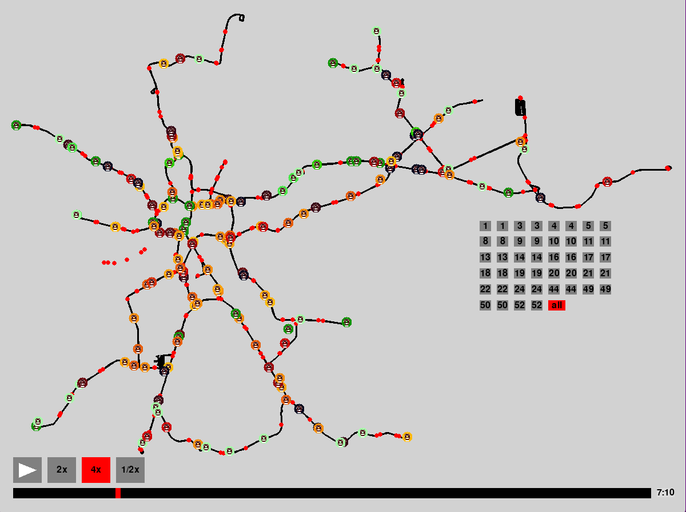
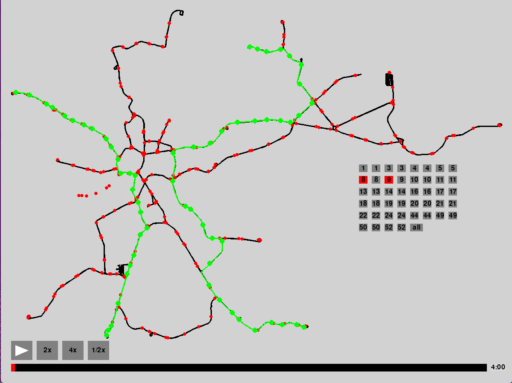

# TRAM NETWORK SIMULATION IN CRACOW
This project aims to create a simplified simulation of overcrowding on the tram network
tramway network in Krakow, using available data and observations. The simulation is intended to serve as an educational and analytical tool, enabling a
a better understanding of the dynamics of streetcar traffic in the city and the identification of
potential congestion points. The goal is to illustrate how various factors, such as passenger numbers and schedules, can affect the fluidity and
efficiency of the streetcar network

## Built With
- Python
- pygame
- numpy
- matplotlib
- beautifulsoup
- html-table-parser
- requests
- shapely
- urllib3


## Getting Started
1. Clone the repo
   ```sh
   git clone https://github.com/corey888773/symulacja-krakowskiej-sieci-tramwajowej.git
   ```
2. To start the project, you need to have Python and Miniconda installed on your computer.

    [Download python](https://www.python.org/downloads/)

    [Download miniconda](https://javedhassans.medium.com/install-miniconda-on-linux-from-the-command-line-in-5-steps-403912b3f378)

3. Set on the project directory.
4. Set up the virtual environment:
   ```sh
   conda create -n <env_name> python=3.12 pip
   conda activate <env_name>
   ```  
   Make sure that you are using conda environment:
   ```sh
   which pip
   ```
   If so install requirements directily or using Makefile:
   ```sh
   pip install -r requirements.txt
   
   make requirements
   ```
5. Running the first time:
   ```sh
   make all
   ```
6. Otherwise run the simulation using:
   ```sh
   make simulation
   ```
   
## Data preparation

### Webscraping
schedule.json - it contains detailed information about timetables. The structure of this file is as follows:
```json
"lines": [
  {
    "number": "1",
    "direction1": {
      "name": "Wańkowicza-CichyKącik",
      "stops": [
        {
          "name": "Wańkowicza 01",
          "schedule": [
            // Tutaj znajdują się wiersze rozkładu ze strony
          ]
        }
      ]
    }
  }
  // Kolejne linie i kierunki
]
```
---

### Open Street Map

open-street-map.json - it contains information about Krakow's streetcar infrastructure, including data on streetcar stops and routes. Example data:
```json
{
  "type": "node",
  "id": 213578731,
  "lat": 50.0791355,
  "lon": 20.0650412,
  "tags": {
    "name": "Kombinat 01",
    "network": "Komunikacja Miejska w Krakowie",
    "network:wikidata": "Q1784404",
    "operator": "MPK Kraków",
    "operator:wikidata": "Q11780297",
    "public_transport": "stop_position",
    "railway": "tram_stop",
    "ref": "107-1t",
    "tram": "yes"
  }
},

{
  "type": "way",
  "id": 20197446,
  "nodes": [
    967037677,
    213602145,
    321437391
  ],
  "tags": {
    "electrified": "contact_line",
    "frequency": "0",
    "gauge": "1435",
    "oneway": "yes",
    "railway": "tram",
    "voltage": "600"
  }
},
```
---
### Data preprocessing

physical_network.json - it contains data about the nodes and edges in the graph, which is mainly used to create the background of the visualization. Data example:
```json
{
  "nodes": [
    {
      "id": 213578731,
      "x": 9103.829277084738,
      "y": 1937.1653281142012,
      "stop_name": "Kombinat01"
    },
    ...
  ],
  "edges": {
    "id": 0,
    "length": 23.928239353451968,
    "max_speed": 50,
    "nodes": [213578731, 8284515580, 213578732],
    ...
  }
}
```

logical_network.json - it contains a range of additional information, such as data on routes, schedules, stops, the number of passengers at stops and much more. This data is the basis for simulating streetcar traffic and overcrowding at specific times. Data example:
```json
{
  "nodes": [
    {
      "id": 213578731,
      "x": 9103.829277084738,
      "y": 1937.1653281142012,
      "stop_name": "Kombinat01"
    },
    ...
  ],
  "edges": [
    {
      "id": 0,
      "length": 23.928239353451968,
      "max_speed": 50,
      "head": 213578731,
      "tail": 213578732
    },
    ...
  ],
  "junctions": [
    {
      "traffic_lights": [2680500169],
      "exits": [3526822325],
      ...
    },
    ...
  ],
  "routes": [
    {
      "id": 1,
      "name": "Wańkowicza-CichyKącik",
      "line": 1,
      "length": 30102.07141235266,
      "stops": [777395555, ..., 2419831874],
      "nodes": [777395555, ..., 213585849],
      ...
    },
    ...
  ],
  "trips": [
    {
      "route": 1,
      "time_table": [286, ..., 326],
      "generation_left": [0, ..., 0],
      "absorption_left": [0, ..., 100, 0]
    },
    ...
  ],
  "passanger_nodes": [
    {
      "name": "Wańkowicza01",
      "ids": [777395555],
      "node_character": "residential_in",
      "generation_rate": [0, ..., 0],
      "absorption_rate": [0, ..., 0],
      "expected_generated_count": 5300
    },
    ...
  ],
  "passanger_edges": [
    {
      "head": "Cienista01",
      "tail": "Wańkowicza01",
      "lines": [1, 7]
    },
    ...
  ],
  "passanger_count": 1036400
}
```


## Simulation and visualization
The simulation makes it possible to track streetcar traffic in Krakow based on previously prepared data in JSON format. The application allows visualization of the streetcar route, filling of vehicles and dynamic reflection of real-time traffic. The user can select specific lines to observe, adjust the speed of the animation and manually control the timing using a slider.





### Tram stops data
```json
{
    "213578731": "TramStop(id=213578731, 
                           x=916.921998695168, 
                           y=242.8166753839978, 
                           stop_name=Kombinat01)",
    ...
}
```

### Edges data
```json
{
    "0": "Edge(id=0, 
               length=23.928239353451968, 
               max_speed=50, 
               head=213578731, 
               tail=213578732)",
    ...
}
```

### Trips data
```json
{
    "1": [
        "Trip(route_id=1, 
              time_table=[286, 287, 289, 292, ...],)",
        ...
    ],
    ...
}
```

### Routes data
```json
{
    "1": "Route(id=1, 
                start=Wańkowicza, 
                stop=CichyKącik, 
                stops=[777395555, 213585855, ...], 
                line=1)",
    ...
}
```

## Contributing
If you have a suggestion that would make this better, please fork the repo and create a pull request. You can also simply open an issue with the tag "enhancement".
Don't forget to give the project a star! Thanks again!

1. Fork the Project
2. Create your Feature Branch (`git checkout -b feature/new-feature`)
3. Commit your Changes (`git commit -m 'Add some new-feature'`)
4. Push to the Branch (`git push origin feature/new-feature`)
5. Open a Pull Request


## License
Distributed under the MIT License. See `LICENSE.txt` for more information.


## Contact
Szymon Frączek - szymoon09@gmail.com

Piotr Gąsiorek - kdzielnicka@gmail.com

Kaja Dzielnicka - pgasiorek773@gmail.com
